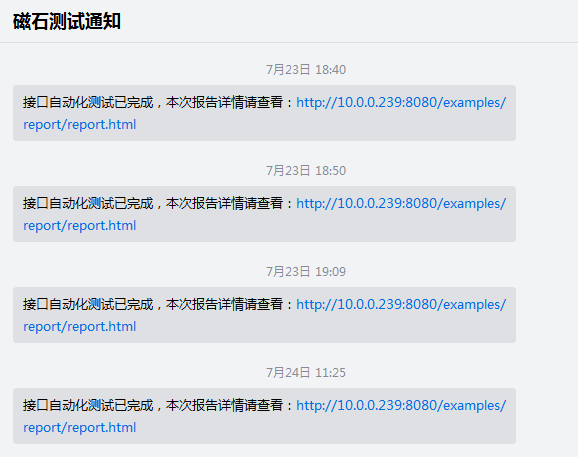

autotest简介

    这是一个接口自动化测试框架，整套框架由 unittest + ddt + requests+ pymysql + BeautifulReport模块组成，测试用例在yamlCase文件中，支持数据驱动、连数据库查询。 
    目前框架已集成jenkins、Git，每天定时执行，并发送测试报告给项目组相关人员。

环境搭建：Linux+python3.5+Tomcat+Jenkins+Git

模块组成：
1、requests
2、unittest  
3、ddt  
4、pymysql  
5、BeautifulReport  
6、yaml

注意事项：需要把BeautifulReport文件夹放到python项目的lib文件site-packages下面

pip install -r requirements.txt 执行这个命令安装依赖包

实现的功能：

1、数据驱动  

2、接口依赖

3、连接数据库查询 

4、自动生成测试报告 

5、自动发送测试邮件

6、接入企业微信或钉钉，触发告警机制发送告警通知

模块介绍：

1、common 中主要放公共方法，操作数据库、读取配置文件、写token、发送邮件、连接企业微信等

2、conf 主要放配置文件、测试环境地址、数据库地址等

3、cases  存放每个接口的测试脚本，脚本以test开头

4、report 存放每次执行完的测试报告

5、yamlCase 存放的是每个接口的测试用例

6、run.py 是测试用例运行入口

7、测试报告

8、点击查看，可以查看详细报错信息，包括用例通过数，失败数，跳过数，用例通过数、失败数所占比例，运行时间，每条用例运行情况等，方便定位问题  

9、接入企业微信

